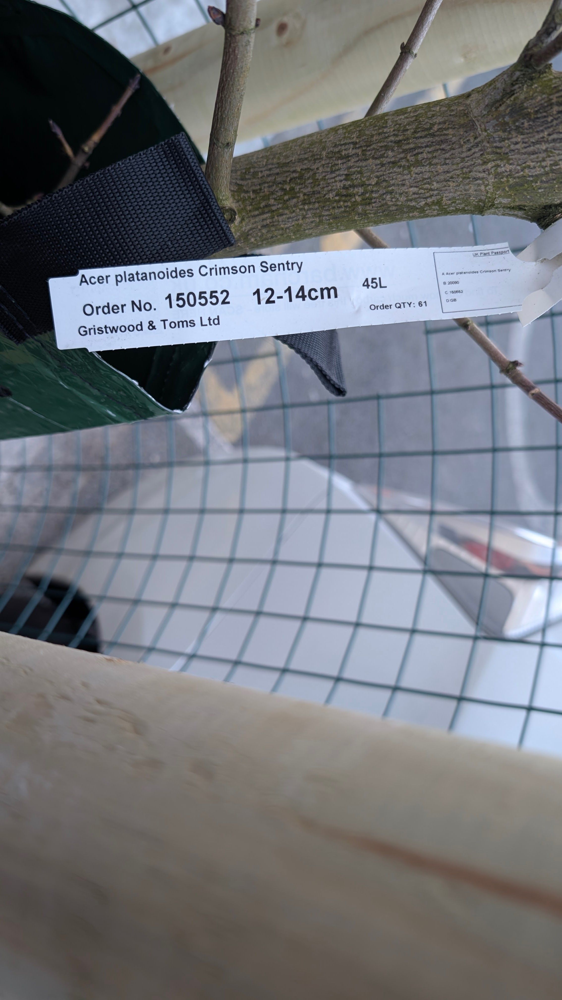
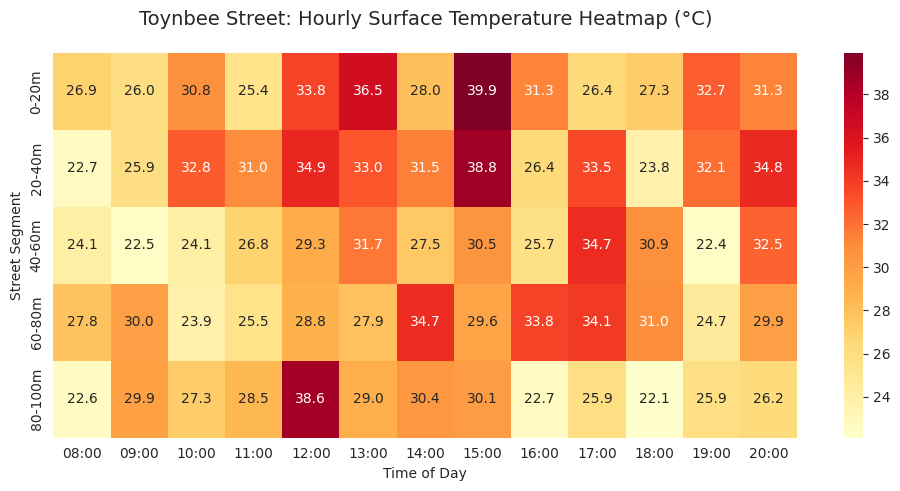
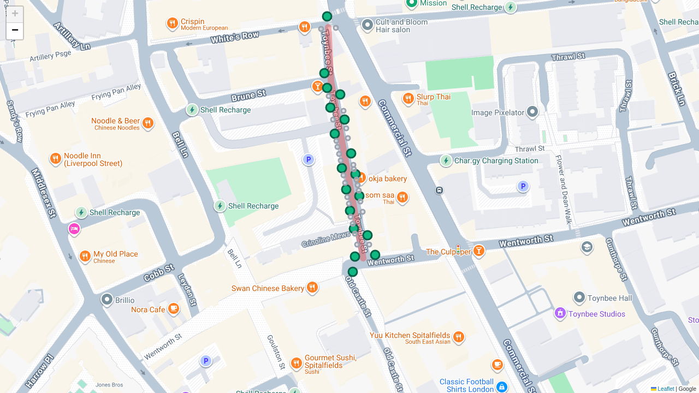
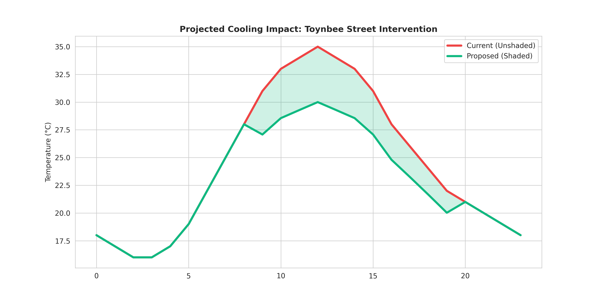
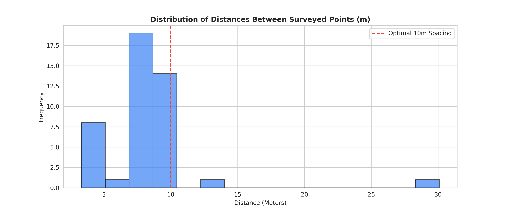

# 🌳 Project Toynbee: Urban Heat Mitigation
**Data-Driven Advocacy for Green Infrastructure**

> **Status:** Active Advocacy Phase  
> **Live Dashboard:** [View Interactive Site](https://jongarmon.github.io/urban-cooling-spitalfields/)

---

## 🌳 0. Implementation: March 2026
*First Crimson Sentry Tree (https://www.rhs.org.uk/plants/46362/acer-platanoides-crimson-sentry/details) planted in Toynbee Street.
Executed by Trees for Streets https://www.treesforstreets.org/*

  
  
  

The planting of Specimen CS-001 (Acer platanoides ‘Crimson Sentry’) serves as the critical "Ground Truth" for this entire initiative.

Species Selection: The ‘Crimson Sentry’ was chosen specifically for its columnar (upright) growth habit. This is a deliberate design choice for Spitalfields' narrow pavements, ensuring maximum shade height without obstructing residential windows or street signage.

Operational Validation: This pilot installation proved that high-impact greening is possible within the existing footprint of Toynbee Street. By successfully navigating the dense network of underground gas and water lines for this single pit, we have established a technical template for the remaining 17 locations.

Visual Audit: The 360-degree technical audit (Photos 01-03) provides transparent evidence of the tree’s integration with the streetscape, confirming that the "Optimal 18" strategy is physically viable, not just a digital model.

---

## 🌡️ 1. The Problem: Urban Heat Island
Spitalfields is a localized "heat trap." Peak summer temperatures discourage active transport.

  
*Figure 1: Surface temperature simulation.*
Spitalfields suffers from a severe Urban Heat Island (UHI) effect, where the dense concentration of brick and asphalt absorbs solar radiation and re-emits it as heat long after the sun sets.

The Thermal Barrier: Current canopy cover in this specific corridor is under 10%. During peak summer hours (14:00–16:00), the lack of transpiration from trees creates "dead zones" of stagnant, hot air that reaches levels dangerous for vulnerable residents.

The Mobility Impact: High surface temperatures actively discourage "Active Transport." People are less likely to walk to local businesses or cycle to work when the environment offers no thermal relief, further increasing the local carbon footprint as people shift to air-conditioned vehicles or avoid the street entirely.

Modeling the Delta: Our simulation (Figure 1) identifies the exact "hot spots" where thermal mass is highest. This data ensures that our proposed trees aren't placed randomly, but are positioned as "Thermal Interrupters" to break up these heat concentrations.

---

## 📏 2. The "Optimal 18" Strategy
We filtered 45 points down to 18 using an 8.5m spacing algorithm.

### Proposed Intervention Map
  
*Figure 2: Selected 18-pit layout.*

  
  

*Figures 3 & 4: Cooling forecast and pit distribution.*

Urban forestry is a public health and safety intervention. By correlating data from the London Ward Profiles, we move the conversation from "aesthetics" to "Social Return on Investment (ROI)."

Safety & Surveillance: Statistical analysis shows a significant negative correlation between high canopy cover and local crime rates. Well-maintained green corridors improve "natural surveillance" and encourage higher footfall, which is a proven deterrent for anti-social behavior.

The Cycling Connection: Data reveals a direct link between tree-lined streets and increased cycling frequency. Shaded "Green Corridors" act as psychological and physical invitations for residents to choose sustainable transport, supporting the Mayor of London's healthy streets targets.

Mental Wellbeing: In high-density wards like Spitalfields & Banglatown, accessible greening is a primary driver of reduced cortisol levels and improved resident mental health. This project treats trees as "Preventative Healthcare" infrastructure that saves the NHS money in the long term.

---

**Analyst:** Jonathan Garcia  
**Contact:** [GitHub Profile](https://github.com/JonGarmon)

---

🗂️ Data Sources & Open Access Links
London Ward Profiles & Atlas (Canopy & Social ROI Data)
Contains the ward-level statistics for tree cover, crime rates, and transport used in the correlation analysis.
https://data.london.gov.uk/dataset/ward-profiles-and-atlas

London Tree Canopy Cover (GLA 2024)
Specific high-resolution data on existing canopy percentages across London boroughs.
https://data.london.gov.uk/dataset/curio-canopy

UK Met Office: Urban Heat Island (UHI) Profiles
Baseline data for atmospheric and surface temperature differentials in London.
https://www.metoffice.gov.uk/research/climate/maps-and-data

Tower Hamlets Open Data Portal
Local infrastructure data, including planned developments and local ward priorities.
https://www.towerhamlets.gov.uk/lgnl/community_and_living/information_and_statistics/

RHS Plant Finder: Acer platanoides 'Crimson Sentry'
Technical specifications for the chosen tree species habit and spacing requirements.
https://www.rhs.org.uk/plants/details?plantid=41

Section 106 & NCIL Funding Protocols
Guidance on how developer levies are allocated for community infrastructure in Tower Hamlets.
https://www.towerhamlets.gov.uk/lgnl/planning_and_building_control/planning_policy_guidance/section_106/

---
