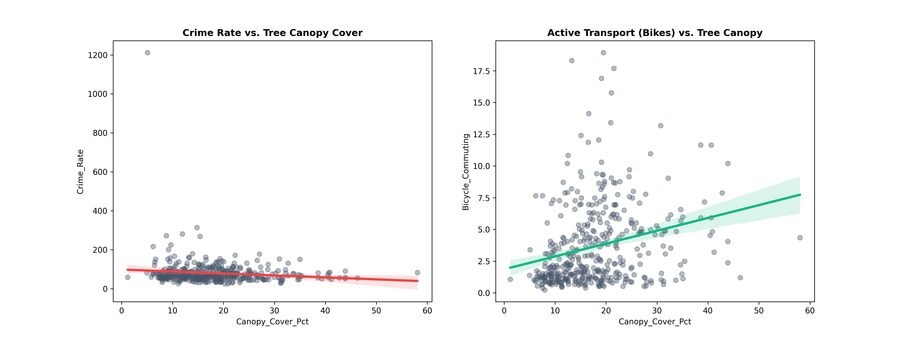

# 🌳 Project Toynbee: Urban Heat Mitigation
**Data-Driven Advocacy for Green Infrastructure in Spitalfields (London E1)**

> **Status:** Active Advocacy Phase  
> **Target:** 30 Signatures to trigger formal Council Response  
> **Live Dashboard:** [View Interactive Site](https://jongarmon.github.io/urban-cooling-spitalfields/)

---

## 🌳 0. Crimson Sentry tree planted in Toynbee Street in March 2026

 

---

## 🌡️ 1. The Problem: Urban Heat Island (UHI)
Spitalfields is a localized "heat trap." Peak summer temperatures discourage active transport and impact health.

  
*Figure 1: Hourly surface temperature simulation.*

---

## 📈 2. The Evidence: Social ROI
Analysis confirms that higher canopy cover correlates with reduced crime and increased cycling.

  
*Figure 2: Statistical correlation between canopy, safety, and transport.*

---

## 📏 3. The Strategy: The "Optimal 18"
We filtered 45 surveyed points down to 18 optimal pits using an 8.5m spacing algorithm.

### Proposed Intervention Map
  
*Figure 3: Selected 18-pit layout.*

### Projected Cooling Impact & Spacing Analysis
We calculated the thermal "flattening" effect and verified pit distribution to avoid utility clusters.

  
*Figure 4: Temperature mitigation forecast.*

  
*Figure 5: Algorithmic distribution of tree pits.*

---

**Lead Analyst:** Jonathan Garcia  
**Contact:** [GitHub Profile](https://github.com/JonGarmon)
